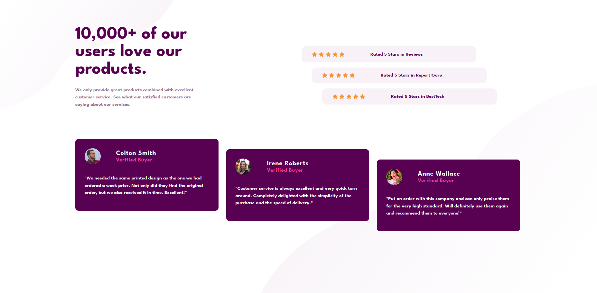
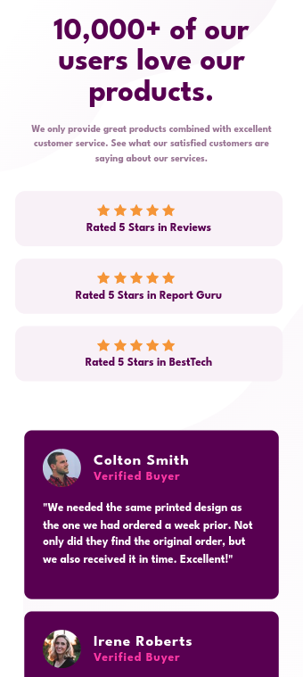

# Frontend Mentor - Social proof section solution

This is a solution to the [Social proof section challenge on Frontend Mentor](https://www.frontendmentor.io/challenges/social-proof-section-6e0qTv_bA). Frontend Mentor challenges help you improve your coding skills by building realistic projects. 

## Table of contents

- [Overview](#overview)
  - [The challenge](#the-challenge)
  - [Screenshot](#screenshot)
  - [Links](#links)
- [My process](#my-process)
  - [Built with](#built-with)
  - [What I learned](#what-i-learned)
  - [Continued development](#continued-development)
- [Author](#author)

## Overview

### The challenge

Users should be able to:

- View the optimal layout for the section depending on their device's screen size

### Screenshot

- Desktop View

- Mobile View

### Links

- Solution URL: [Add solution URL here](https://your-solution-url.com)
- Live Site URL: [Add live site URL here](https://your-live-site-url.com)

## My process

### Built with

- Semantic HTML5 markup
- CSS custom properties
- Flexbox
- CSS Grid
- Boostrap

### What I learned

I learned it is much better to plan ahead of any projects, do basic sketch, choose classes for each elements in the layout and how you'd implement it before starting to write code as doing this saves you a lot of time.

### Continued development

I would like to be better at better web development practices, less repitiion and also get better at responsive designs

## Author

- Frontend Mentor - [@Julius-Java](https://www.frontendmentor.io/profile/julius-java)
- Twitter - [@Julius_Java00](https://www.twitter.com/julius_java00)
